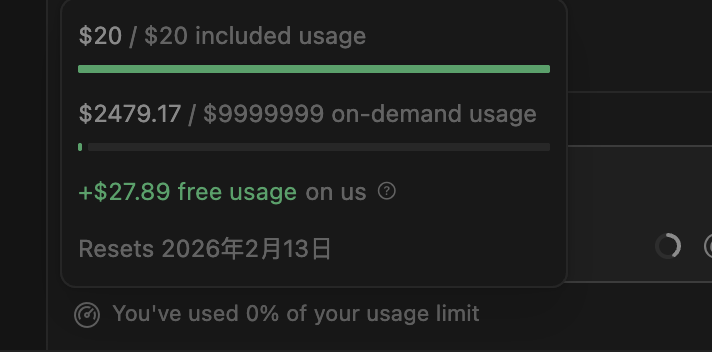

# 🚀 Cursor Free Trial Reset Tool

<div align="center">

[](https://github.com/yuaotian/go-cursor-help/releases/latest)
[](https://github.com/yuaotian/go-cursor-help/blob/master/LICENSE)
[](https://github.com/yuaotian/go-cursor-help/stargazers)

[🌟 English](README.md) | [🌏 中文](README_CN.md) | [🌏 日本語](README_JP.md)


</div>

---

<div align="center">

## ⚡️ [Flash Sale] Cursor Pro High‑Credit Accounts

  

> 💡 Get **$65+** usage value for only **$12**! | 📖 [Official Pricing Reference](https://cursor.com/cn/docs/account/pricing)

<!-- ==================== 📦 Cursor Product Plans Overview ==================== -->

| Type | Plan | 💰 Price | 📊 Official | 💎 Total Value / Note |
|:---:|:---|:---:|:---:|:---|
| **🏆 Member** | **Pro** 🔥 `HOT` | **¥65** / $12 | $20 | ≈ **$45–$65** (Base+Rewards+Overdraft) |
| **🏆 Member** | **Pro+** 💫 | **¥265** / $40 | $60 | ≈ **$95–$130** (Base+Rewards+Overdraft) |
| **🏆 Member** | **Ultra** 👑 `FLAGSHIP` | **¥888** / $140 | $200 | ≈ **$400+** (Base+Massive Rewards) |
| **🏆 Member** | **Unlimited ♾️** 👑 `FLAGSHIP` | **¥1050** / $150 | $200 | **真正无限额度**（官方可查，10天质保） |
| **🎯 Limited** | **7天周卡 $100** 🏷️ | **¥210** / $30 | $100 | 7天独享 $100 额度，官方计费，按天售后 |
| **🎯 Limited** | **7天周卡 $500** 💎 | **¥1050** / $150 | $500 | 7天独享 $500 额度，适合高强度开发 |
| **🎯 Limited** | **7天周卡 $1000** 🔥 | **¥2450** / $350 | $1000 | 7天独享 $1000 额度，超高强度开发 |
| **🆕 Basic** | **Cursor Trial Acct** | **$3** /each | — | Guaranteed working, Bulk discount |
| **🆕 Basic** | **Gemini 3.0 Pro** 💎 | **¥85** / $10 | — | 1-Year Sub, Stable Google Acct, 3-Day Warranty |

> ℹ️ **Value Note**: Member plan total value = Base Credits + Rewards + Overdraft (monthly resets apply).

<details>
<summary>📋 <b>Product Details</b> (Click to expand)</summary>

<br>

---

#### ♾️ Unlimited 无限额度详情
| 项目 | 说明 |
|:---|:---|
| **商品名称** | Cursor 无限额度 ♾️ 官方号 |
| **售价** | ¥1050 / $150 |
| **官方价值** | $9999999 |
| **核心特点** | 真正无限额度（99999额度显示），个人独享，官方可查 |
| **有效期** | 30天（10天质保期，支持按天退款） |

> 🖼️ **无论怎么用都用不完！** 

---

#### 🏷️ 7天商业版周卡系列详情
> **⚠️ 重要提醒：7天周卡系列有效期为7天整（从发货时间起算），到期自动删号！**

| 版本 | 额度 | 售价 | 说明 |
|:---|:---|:---|:---|
| **$100版** | $100 | **¥210** / $30 | 7天独享 $100 额度，官方计费，按天售后 |
| **$500版** | $500 | **¥1050** / $150 | 7天独享 $500 额度，高强度开发首选 |
| **$1000版** | $1000 | **¥2450** / $350 | 7天独享 $1000 额度，超高强度开发 |

| 通用说明 | 内容 |
|:---|:---|
| **服务内容** | Cursor 官网商业版会员 - 7天周卡 |
| **官方权益** | 个人独享官方账号，全功能開放，无限速 |
| **使用限制** | 官方按量计费，额度用完即止。需自备网络加速工具 |

---

#### 💳 Cursor Trial Account Details
| Item | Description |
|:---|:---|
| **Delivery Format** | `Account ---- Cursor Password ---- Email Password ---- Long-term cookies` |
| **Warranty** | Check within **1 hour** of receipt. No support after timeout |
| **Login URL** | cursor.com (Direct Login) |

---

#### 💎 Gemini 3.0 Pro Details
| Item | Description |
|:---|:---|
| **Description** | 3-Day Warranty. Super stable Google accounts (6mo-1yr+). Quality far exceeds temporary email accounts. Suitable even for GCP |
| **Account Format** | `Account----Password----Recovery Email----2FA` |
| **Instructions** | ① Immediately bind your own recovery email, password, and phone number after login ② **Important**: Keep using the same IP address for the first 3 days |

</details>

---

<!-- ==================== 📢 Purchase Notice & Contact ==================== -->

| ⚠️ **Before You Buy** | 📱 **Contact** |
|:---|:---|
| 💎 Legit top-up, private account |  [@yuaotian](https://t.me/yuaotian) |
| ⏱️ Valid 25–30 days \| 💻 Recommended ≤3 devices |  `JavaRookie666` |
| 🛡️ 7-day warranty (replacement / pro-rated refund) | |

---

### 📢 Advertising Space

> 🔥 **Ad Space Available** - Contact for partnership opportunities
>
> 📧 Contact: Telegram [@yuaotian](https://t.me/yuaotian) | WeChat: `JavaRookie666`

---

</div>

> ⚠️ **IMPORTANT NOTICE**
> 
> This tool currently supports:
> - ✅ Windows: Latest 2.x.x versions (Supported)
> - ✅ Mac/Linux: Latest 2.x.x versions (Supported, feedback welcome)
>
> Please check your Cursor version before using this tool.

---

### 🚀 One-Click Solution

<details open>
<summary><b>Global Users</b></summary>

**macOS**

```bash
curl -fsSL https://raw.githubusercontent.com/yuaotian/go-cursor-help/refs/heads/master/scripts/run/cursor_mac_id_modifier.sh -o ./cursor_mac_id_modifier.sh && sudo bash ./cursor_mac_id_modifier.sh && rm ./cursor_mac_id_modifier.sh
```

**Linux**

```bash
curl -fsSL https://raw.githubusercontent.com/yuaotian/go-cursor-help/refs/heads/master/scripts/run/cursor_linux_id_modifier.sh | sudo bash 
```

> **Note for Linux users:** The script attempts to find your Cursor installation by checking common paths (`/usr/bin`, `/usr/local/bin`, `$HOME/.local/bin`, `/opt/cursor`, `/snap/bin`), using the `which cursor` command, and searching within `/usr`, `/opt`, and `$HOME/.local`. If Cursor is installed elsewhere or not found via these methods, the script may fail. Ensure Cursor is accessible via one of these standard locations or methods.

**Windows**

```powershell
irm https://raw.githubusercontent.com/yuaotian/go-cursor-help/refs/heads/master/scripts/run/cursor_win_id_modifier.ps1 | iex
```

**Tip (Windows):** If you suspect a cached old script (mirror/proxy cache), append a timestamp query parameter to bypass cache:

```powershell
irm "https://raw.githubusercontent.com/yuaotian/go-cursor-help/refs/heads/master/scripts/run/cursor_win_id_modifier.ps1?$(Get-Date -Format yyyyMMddHHmmss)" | iex
```


</details>


<details open>
<summary><b>China Users (Recommended)</b></summary>

**macOS**

```bash
curl -fsSL https://wget.la/https://raw.githubusercontent.com/yuaotian/go-cursor-help/refs/heads/master/scripts/run/cursor_mac_id_modifier.sh -o ./cursor_mac_id_modifier.sh && sudo bash ./cursor_mac_id_modifier.sh && rm ./cursor_mac_id_modifier.sh
```

**Linux**

```bash
curl -fsSL https://wget.la/https://raw.githubusercontent.com/yuaotian/go-cursor-help/refs/heads/master/scripts/run/cursor_linux_id_modifier.sh | sudo bash
```

**Windows**

```powershell
irm https://wget.la/https://raw.githubusercontent.com/yuaotian/go-cursor-help/refs/heads/master/scripts/run/cursor_win_id_modifier.ps1 | iex
```

**Tip (Windows):** If the mirror caches old content, append `?$(Get-Date -Format yyyyMMddHHmmss)` to the URL:

```powershell
irm "https://wget.la/https://raw.githubusercontent.com/yuaotian/go-cursor-help/refs/heads/master/scripts/run/cursor_win_id_modifier.ps1?$(Get-Date -Format yyyyMMddHHmmss)" | iex
```

</details>


<div align="center">

</div>

<details open>
<summary><b>Windows Terminal Run and Configuration</b></summary>

#### How to Open Administrator Terminal in Windows:

##### Method 1: Using Win + X Shortcut
```md
1. Press Win + X key combination
2. Select one of these options from the menu:
   - "Windows PowerShell (Administrator)"
   - "Windows Terminal (Administrator)"
   - "Terminal (Administrator)"
   (Options may vary depending on Windows version)
```

##### Method 2: Using Win + R Run Command
```md
1. Press Win + R key combination
2. Type powershell or pwsh in the Run dialog
3. Press Ctrl + Shift + Enter to run as administrator
   or type in the opened window: Start-Process pwsh -Verb RunAs
4. Enter the reset script in the administrator terminal:

irm https://wget.la/https://raw.githubusercontent.com/yuaotian/go-cursor-help/refs/heads/master/scripts/run/cursor_win_id_modifier.ps1 | iex
```

For the enhanced version:
```powershell
irm https://wget.la/https://raw.githubusercontent.com/yuaotian/go-cursor-help/refs/heads/master/scripts/run/cursor_win_id_modifier.ps1 | iex
```

##### Method 3: Using Search
>
>
>Type pwsh in the search box, right-click and select "Run as administrator"
>

Enter the reset script in the administrator terminal:
```powershell
irm https://wget.la/https://raw.githubusercontent.com/yuaotian/go-cursor-help/refs/heads/master/scripts/run/cursor_win_id_modifier.ps1 | iex
```

For the enhanced version:
```powershell
irm https://wget.la/https://raw.githubusercontent.com/yuaotian/go-cursor-help/refs/heads/master/scripts/run/cursor_win_id_modifier.ps1 | iex
```

### 🔧 PowerShell Installation Guide 

If PowerShell is not installed on your system, you can install it using one of these methods:

#### Method 1: Install via Winget (Recommended)

1. Open Command Prompt or PowerShell
2. Run the following command:
```powershell
winget install --id Microsoft.PowerShell --source winget
```

#### Method 2: Manual Installation

1. Download the installer for your system:
   - [PowerShell-7.4.6-win-x64.msi](https://github.com/PowerShell/PowerShell/releases/download/v7.4.6/PowerShell-7.4.6-win-x64.msi) (64-bit systems)
   - [PowerShell-7.4.6-win-x86.msi](https://github.com/PowerShell/PowerShell/releases/download/v7.4.6/PowerShell-7.4.6-win-x86.msi) (32-bit systems)
   - [PowerShell-7.4.6-win-arm64.msi](https://github.com/PowerShell/PowerShell/releases/download/v7.4.6/PowerShell-7.4.6-win-arm64.msi) (ARM64 systems)

2. Double-click the downloaded installer and follow the installation prompts

> 💡 If you encounter any issues, please refer to the [Microsoft Official Installation Guide](https://learn.microsoft.com/en-us/powershell/scripting/install/installing-powershell-on-windows)

</details>

#### Windows 安装特性:

- 🔍 Automatically detects and uses PowerShell 7 if available
- 🛡️ Requests administrator privileges via UAC prompt
- 📝 Falls back to Windows PowerShell if PS7 isn't found
- 💡 Provides manual instructions if elevation fails

That's it! The script will:

1. ✨ Install the tool automatically
2. 🔄 Reset your Cursor trial immediately

### 📦 Manual Installation

> Download the appropriate file for your system from [releases](https://github.com/yuaotian/go-cursor-help/releases/latest)

<details>
<summary>Windows Packages</summary>

- 64-bit: `cursor-id-modifier_windows_x64.exe`
- 32-bit: `cursor-id-modifier_windows_x86.exe`
</details>

<details>
<summary>macOS Packages</summary>

- Intel: `cursor-id-modifier_darwin_x64_intel`
- M1/M2: `cursor-id-modifier_darwin_arm64_apple_silicon`
</details>

<details>
<summary>Linux Packages</summary>

- 64-bit: `cursor-id-modifier_linux_x64`
- 32-bit: `cursor-id-modifier_linux_x86`
- ARM64: `cursor-id-modifier_linux_arm64`
</details>

### 🔧 Technical Details

<details>
<summary><b>Configuration Files</b></summary>

The program modifies Cursor's `storage.json` config file located at:

- Windows: `%APPDATA%\Cursor\User\globalStorage\storage.json`
- macOS: `~/Library/Application Support/Cursor/User/globalStorage/storage.json`
- Linux: `~/.config/Cursor/User/globalStorage/storage.json`
</details>

<details>
<summary><b>Modified Fields</b></summary>

The tool generates new unique identifiers for:

- `telemetry.machineId`
- `telemetry.macMachineId`
- `telemetry.devDeviceId`
- `telemetry.sqmId`
</details>

<details>
<summary><b>Manual Auto-Update Disable</b></summary>

Windows users can manually disable the auto-update feature:

1. Close all Cursor processes
2. Delete directory: `C:\Users\username\AppData\Local\cursor-updater`
3. Create a file with the same name: `cursor-updater` (without extension)

macOS/Linux users can try to locate similar `cursor-updater` directory in their system and perform the same operation.

</details>

<details>
<summary><b>Safety Features</b></summary>

- ✅ Safe process termination
- ✅ Atomic file operations
- ✅ Error handling and recovery
</details>

<details>
<summary><b>Registry Modification Notice</b></summary>

> ⚠️ **Important: This tool modifies the Windows Registry**

#### Modified Registry
- Path: `Computer\HKEY_LOCAL_MACHINE\SOFTWARE\Microsoft\Cryptography`
- Key: `MachineGuid`

#### Potential Impact
Modifying this registry key may affect:
- Windows system's unique device identification
- Device recognition and authorization status of certain software
- System features based on hardware identification

#### Safety Measures
1. Automatic Backup
   - Original value is automatically backed up before modification
   - Backup location: `%APPDATA%\Cursor\User\globalStorage\backups`
   - Backup file format: `MachineGuid.backup_YYYYMMDD_HHMMSS`

2. Manual Recovery Steps
   - Open Registry Editor (regedit)
   - Navigate to: `Computer\HKEY_LOCAL_MACHINE\SOFTWARE\Microsoft\Cryptography`
   - Right-click on `MachineGuid`
   - Select "Modify"
   - Paste the value from backup file

#### Important Notes
- Verify backup file existence before modification
- Use backup file to restore original value if needed
- Administrator privileges required for registry modification
</details>

---

### 📚 Recommended Reading

- [Cursor Issues Collection and Solutions](https://mp.weixin.qq.com/s/pnJrH7Ifx4WZvseeP1fcEA)
- [AI Universal Development Assistant Prompt Guide](https://mp.weixin.qq.com/s/PRPz-qVkFJSgkuEKkTdzwg)

---

## 💬 Feedback & Suggestions

We value your feedback on the new enhanced script! If you've tried the `cursor_win_id_modifier.ps1` script, please share your experience:

- 🐛 **Bug Reports**: Found any issues? Let us know!
- 💡 **Feature Suggestions**: Have ideas for improvements?
- ⭐ **Success Stories**: Share how the tool helped you!
- 🔧 **Technical Feedback**: Performance, compatibility, or usability insights

Your feedback helps us improve the tool for everyone. Feel free to open an issue or contribute to the project!

---

##  Support

<div align="center">
<b>If you find this helpful, consider buying me a spicy gluten snack (Latiao) as appreciation~ 💁☕️</b>
<table>
<tr>

<td align="center">
<b>微信赞赏</b><br>
<br>
<small>要到饭咧？啊咧？啊咧？不给也没事~ 请随意打赏</small>
</td>
<td align="center">
<b>支付宝赞赏</b><br>
<br>
<small>如果觉得有帮助,来包辣条犒劳一下吧~</small>
</td>
<td align="center">
<b>Alipay</b><br>
<br>
<em>1 Latiao = 1 AI thought cycle</em>
</td>
<td align="center">
<b>WeChat</b><br>
<br>
<em>二维码7天内(11月25日前前)有效，过期请加微信或者公众号`煎饼果子卷AI`</em>
</td>
<!-- <td align="center">
<b>ETC</b><br>
<br>
ETC: 0xa2745f4CD5d32310AC01694ABDB28bA32D125a6b
</td>
<td align="center"> -->
</td>
</tr>
</table>
</div>

### 💳 Payment Methods (Donate / Remove Ads)

- 🪙 **USDT (Tether)**
  - 🔴 TRC-20 (Tron): `TFbJnoY5Lep5ZrDwBbT8rV1i8xR4ZhX53k`
  - 🟡 Polygon / BSC / Arbitrum: `0x44f8925b9f93b3d6da8d5ad26a3516e3e652cc88`
- 🟦 **Litecoin (LTC)**: `LVrigKxtWfPymMRtRqL3z2eZxfncR3dPV7`

---

## ⭐ Project Stats

<div align="center">

[](https://star-history.com/#yuaotian/go-cursor-help&Date)


</div>

## 📄 License

<details>
<summary><b>MIT License</b></summary>

Copyright (c) 2024

Permission is hereby granted, free of charge, to any person obtaining a copy
of this software and associated documentation files (the "Software"), to deal
in the Software without restriction, including without limitation the rights
to use, copy, modify, merge, publish, distribute, sublicense, and/or sell
copies of the Software, and to permit persons to whom the Software is
furnished to do so, subject to the following conditions:

The above copyright notice and this permission notice shall be included in all
copies or substantial portions of the Software.

</details>

